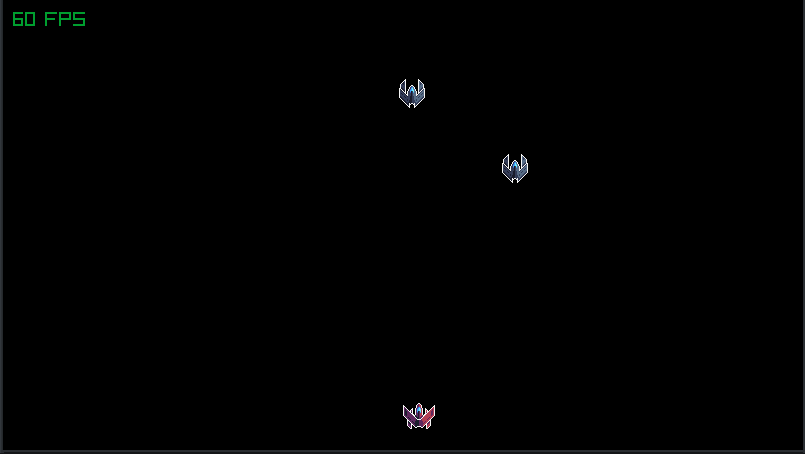

# Spice

A space invaders [Space Invaders](https://en.wikipedia.org/wiki/Space_Invaders) implementation in Zig and Raylib.



## Quickstart

**Nix (Devenv)**

Install Nix and Devenv. [Instructions](https://devenv.sh/getting-started/)

```
git clone https://github.com/MashyBasker/spice

cd spice/

devenv shell

make
```


**Ubuntu / Debian**

Make sure to have Zig installed

```
sudo apt update
sudo apt install build-essential pkg-config

sudo apt install libx11-dev libxcursor-dev libxext-dev libxfixes-dev libxi-dev libxinerama-dev libxrandr-dev libxrender-dev libgl1-mesa-dev libwayland-dev libxkbcommon-dev

sudo apt install libasound2-dev libpulse-dev pipewire-dev

git clone https://github.com/MashyBasker/spice

cd spice/

zig fetch --save git+https://github.com/Not-Nik/raylib-zig#devel

make

```

**Arch Linux**

Make sure to have Zig installed

```
sudo pacman -S libx11 libxcursor libxext libxfixes libxi libxinerama libxrandr libxrender mesa wayland libxkbcommon

sudo pacman -S alsa-lib pulseaudio pipewire

git clone https://github.com/MashyBasker/spice

cd spice/

zig fetch --save git+https://github.com/Not-Nik/raylib-zig#devel

make
```
